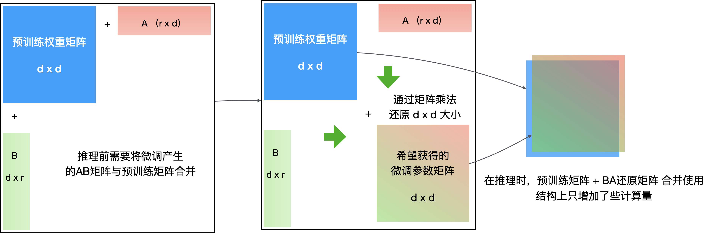

## AI论文解读 | 低秩微调大模型 LoRA: Low-Rank Adaptation of Large Language Models  
                    
### 作者                    
digoal                    
                    
### 日期                    
2025-04-23                   
                    
### 标签                    
PostgreSQL , PolarDB , DuckDB , AI , 论文解读        
                    
----                    
                    
## 背景           
https://arxiv.org/pdf/2106.09685  
  
提示:  
```  
读懂《LoRA: Low-Rank Adaptation of Large Language Models》这篇论文需要提前掌握哪些基础知识, 请给我讲一下这些基础知识, 尽量通熟易懂, 可以使用mermaid图增加解释性.     
  
通熟易懂的解读《LoRA: Low-Rank Adaptation of Large Language Models》这篇论文, 关键内容请深入讲解, 可以使用mermaid图增加解释性.     
  
提取《LoRA: Low-Rank Adaptation of Large Language Models》论文中一些重要的术语并详细解释, 可以使用mermaid图示增加解释性.     
```  
  
## 1 前置知识  
理解《LoRA: Low-Rank Adaptation of Large Language Models》这篇论文，建议提前掌握以下几个基础知识点。下面将用通俗的语言解释每个概念，并配以mermaid图示增强理解。  
  
---  
  
### 1. 神经网络基本结构  
  
**核心思想**：神经网络是由“神经元”组成的多层“网络”，每层的输出作为下一层的输入。  
  
**关键要素**：  
- **输入层**、**隐藏层**、**输出层**  
- **权重矩阵**（决定输入如何转化为输出）  
  
```mermaid  
graph TD  
    A[输入层] --> B[隐藏层1]  
    B --> C[隐藏层2]  
    C --> D[输出层]  
```  
  
---  
  
### 2. 大型语言模型（LLM）  
  
**核心思想**：像GPT、BERT这类模型包含了数亿甚至数千亿的参数（权重），能处理和理解复杂语言。  
  
- **Transformer结构**是Lora论文背景的主流模型架构之一。  
  
```mermaid  
graph TD  
    Input[输入]  
    Encoder[编码器]  
    Decoder[解码器]  
    Output[输出]  
    Input --> Encoder  
    Encoder --> Decoder  
    Decoder --> Output  
```  
  
---  
  
### 3. 神经网络中的权重矩阵  
  
**本质**：每一层之间的“变换”都可以看作一个大矩阵（权重矩阵）的乘法。  
  
- 在LLM中，这些矩阵非常大，参数多，存储和训练都很消耗资源。  
  
---  
  
### 4. 矩阵的秩（Rank）  
  
**通俗解释**：矩阵的“秩”就是这个矩阵里有多少“独立信息”。秩越高，信息越丰富。  
  
- **低秩（Low-Rank）近似**：把一个大矩阵拆成两个小矩阵相乘，无需保留全部信息，只保留最重要的信息。  
  
```mermaid  
graph LR  
    W[大矩阵 W] -->|近似分解| A[小矩阵 A]  
    W -->|近似分解| B[小矩阵 B]  
    A & B -->|矩阵乘法| W_approx[近似矩阵 W']  
    W_approx -.->|与 W 比较| Evaluation[评估误差]  
    style Evaluation fill:#f9f,stroke:#333,stroke-width:2px  
```  
> 这样可以节省空间和计算量。  
  
---  
  
### 5. 微调（Fine-tuning）与参数高效训练  
  
- **全参数微调**：直接调整整个模型的全部参数，计算和存储开销巨大。  
- **参数高效微调（如LoRA）**：只训练很少一部分参数，其他参数保持不变，节省资源。  
  
---  
  
### 6. LoRA的核心思想  
  
- 在原有大权重矩阵上，“插入”一个低秩矩阵调整项，只训练这个小的低秩部分。  
- 这样既能高效调整模型行为，又不用大幅度增加参数量和显存消耗。  
  
```mermaid  
flowchart TD  
    W[原始权重W] -->|冻结| 模型  
    Delta[小的低秩矩阵ΔW] -->|只训练ΔW| 模型  
    模型[最终输出]  
```  
  
---  
  
### 7. 相关数学基础  
  
- **矩阵乘法**：神经网络中信息流动的基本运算。  
- **奇异值分解（SVD）**：常用的低秩近似工具（了解概念即可）。  
- **线性代数基础**：向量、矩阵、秩等。  
  
---  
  
### 总结知识点关联  
  
```mermaid  
graph LR  
    神经网络 --> 权重矩阵  
    权重矩阵 --> 矩阵秩  
    权重矩阵 --> LLM  
    LLM --> 微调  
    微调 --> LoRA  
    矩阵秩 --> LoRA  
    线性代数 --> 矩阵乘法  
    矩阵乘法 --> 矩阵秩  
    矩阵乘法 --> 权重矩阵  
```  
  
---  
  
**建议学习顺序**：    
线性代数基础 → 神经网络结构 → 权重矩阵与矩阵乘法 → 大型语言模型 → 微调方式 → 矩阵低秩近似 → LoRA原理  
  
如果对上述某一块还不够明白，可以告诉我，我会进一步详细解释！  
  
## 2 解读论文  
  
下面用通俗易懂的语言为你解读《LoRA: Low-Rank Adaptation of Large Language Models》这篇论文的关键内容，并穿插 mermaid 图帮助你理解。  
  
---  
  
### 一、LoRA 是什么？  
  
LoRA 的全称是**Low-Rank Adaptation**，是一种让大语言模型（比如 GPT、BERT）高效微调的新方法。    
它的核心思想就是：**不用改动或存储大模型的全部参数，只对很小一部分参数进行调整，就能让大模型适应新任务。**  
  
---  
  
### 二、为什么要用 LoRA？  
  
1. **大模型参数太多，微调成本高**    
   传统微调（Fine-tuning）需要对每个任务都保存一份完整的模型参数，既费时又费空间。  
  
2. **显存不够**    
   直接微调大模型内存和显卡显存压力巨大。  
  
3. **多任务不方便**    
   每来一个新任务都要存一份大模型，很浪费。  
  
**LoRA 的目标：只需存很小的“微调增量”，显存和存储都省很多，还能达到接近全量微调的效果。**  
  
---  
  
### 三、LoRA 的核心思想  
  
#### 1. 大模型的“权重矩阵”  
  
神经网络的每一层其实就是做矩阵乘法（输入×权重矩阵 → 输出）。    
模型的“记忆”都在这些大大的权重矩阵里。  
  
```mermaid  
graph TD  
    Input[输入向量] -->|乘权重W| Output[输出向量]  
```  
  
#### 2. 传统微调 VS LoRA  
  
- **传统微调**：直接改变权重矩阵 W（参数量巨大）  
- **LoRA**：让 W 本身保持不变，额外加一个“小的可训练矩阵”来调整输出  
  
##### 公式对比  
  
- 传统微调：    
  \( y = W x \)（W会被更新）  
  
- LoRA 微调：    
  \( y = (W + \Delta W)x \)    
  其中 \(\Delta W = BA\)，A和B是小矩阵（低秩），只训练A和B  
  
```mermaid  
flowchart TD  
    subgraph LoRA微调  
        W[大权重矩阵W] --"保持冻结"--> out1[输出]  
        DeltaW[LoRA增量ΔW（B×A）] --"只训练这部分"--> out2[输出]  
    end  
    out1 --"叠加"--> out2  
```
  
  
  
#### 3. 为什么用“低秩矩阵”？  
  
- 大矩阵的信息其实有冗余，很多信息可以用小矩阵（低秩）近似表达。  
- 只用小矩阵调整，大幅减少参数量。  
- 低秩矩阵用两个小矩阵相乘代替一个大矩阵。  
  
```mermaid  
flowchart LR  
    W[大矩阵W] ==低秩近似==> B[矩阵B] --> A[矩阵A]  
    W -.->|近似| BA  
```  
  
---  
  
### 四、LoRA 具体怎么做？  
  
1. **冻结原模型权重 W，不更新**  
2. **插入两个小矩阵 A（r×d）、B（d×r）**，初始化为很小的值。  
3. **训练时只训练A和B**，其他参数保持不变。  
4. **推理时把A、B的乘积加到W上**，得到新的输出。  
  
- 这样，每个任务只需保存A和B（远比W小），大大节省空间和计算资源。  
  
---  
  
### 五、LoRA 的优点  
  
- **高效：** 只多存和多算很少的参数  
- **灵活：** 多任务只需保存不同的A、B  
- **性能好：** 微调效果和全量微调非常接近  
  
---  
  
### 六、实验效果  
  
论文大量实验表明，LoRA只用很小的增量参数，在各种NLP任务（如文本分类、问答等）上都能达到和全参数微调几乎一样的效果。  
  
---  
  
### 七、总结知识结构图  
  
```mermaid  
graph TD  
    大模型权重W -->|微调| 传统微调  
    大模型权重W -->|冻结| LoRA  
    LoRA --> 低秩矩阵A  
    LoRA --> 低秩矩阵B  
    低秩矩阵A & 低秩矩阵B --> 增量ΔW  
    增量ΔW --> LoRA输出  
    传统微调 --> 传统输出  
    LoRA输出 & 传统输出 --> 性能对比  
```  
  
---  
  
### 八、核心公式回顾（通俗解释）  
  
\[  
y = (W + BA) x  
\]  
  
- W：原有大权重矩阵（不变）  
- A、B：小矩阵（可训练）  
- BA：LoRA“插入”的小增量  
  
---  
  
### 九、打个比方  
  
- 原模型好比一座大楼（W），LoRA就像给大楼装了几组新电梯（A、B），只改动电梯，不动大楼本体，但大家乘电梯也能快到目标楼层（新任务）。  
  
---  
  
如果对某个环节还想更细致地了解，欢迎再问我详细拆解！  
  
## 3 术语  
  
以下是《LoRA: Low-Rank Adaptation of Large Language Models》论文中的一些重要术语，并配以详细解释和 mermaid 图示帮助理解：  
  
---  
  
### 1. 权重矩阵（Weight Matrix）  
  
**解释**：    
神经网络每一层的参数通常以一个二维矩阵（权重矩阵）的形式存在，输入经过这个矩阵乘法后，得到输出。  
  
```mermaid  
flowchart LR  
    X[输入向量] -- 乘以 W --> Y[输出向量]  
```  
> 其中 W 就是权重矩阵。  
  
---  
  
### 2. 微调（Fine-tuning）  
  
**解释**：    
在预训练好的模型基础上，针对特定任务继续训练全部参数，使模型适应新任务。  
  
```mermaid  
flowchart TD  
    Pretrain[预训练模型] -- 微调 --> TaskModel[特定任务模型]  
```  
  
---  
  
### 3. 低秩分解（Low-Rank Decomposition）  
  
**解释**：    
将一个大矩阵近似分解成两个小矩阵相乘，从而减少参数和计算量。    
比如，将一个 m×n 的矩阵分解为 m×r 和 r×n 两个小矩阵，并且 r≪min(m, n)。  
  
```mermaid  
flowchart LR  
    W[大矩阵 W] --≈--> B[小矩阵 B] & A[小矩阵 A]  
    B -.->|乘| BA  
    A -.->|乘| BA  
```  
  
---  
  
### 4. LoRA 增量权重（LoRA Delta, ΔW）  
  
**解释**：    
LoRA 并不直接修改原始权重矩阵 W，而是引入一个增量 ΔW（且 ΔW=BA，B、A为低秩小矩阵），训练时只优化ΔW。  
  
```mermaid  
flowchart TD  
    W[原始权重 W] --冻结不变--> Out1[输出1]  
    DeltaW[增量 ΔW = BA] --只训练--> Out2[输出2]  
    Out1 --"叠加"--> Out2  
```  
  
---  
  
### 5. 参数高效微调（Parameter-Efficient Fine-tuning, PEFT）  
  
**解释**：    
只训练和存储很少的新参数（如LoRA的增量矩阵），大部分参数保持不变，从而实现高效的多任务适应和部署。  
  
```mermaid  
flowchart TD  
    Pretrain[大型预训练模型]  
    LoRA[LoRA增量参数]  
    TaskModel[适应新任务模型]  
  
    Pretrain --冻结--> TaskModel  
    LoRA --插入--> TaskModel  
```  
  
---  
  
### 6. 秩（Rank）  
  
**解释**：    
矩阵的秩是衡量其信息量或独立性的指标。低秩意味着矩阵的信息可以被更少的向量组合表达。  
  
```mermaid  
flowchart LR  
    高秩[高秩矩阵] --冗余多--> 低秩[低秩矩阵] --信息压缩--> 近似表达  
```  
  
---  
  
### 7. 插入适配器（Adapter Insertion）  
  
**解释**：    
在原有神经网络层之间插入小的可训练模块（如LoRA的低秩矩阵），对模型进行局部微调。  
  
```mermaid  
flowchart LR  
    原始层 --> LoRA适配器 --> 下一层  
```  
  
---  
  
### 8. 冻结参数（Parameter Freezing）  
  
**解释**：    
训练时保持原有模型参数不变，只更新新加入的适配器或增量参数。  
  
```mermaid  
flowchart TD  
    W[大模型参数W] --冻结--> 不更新  
    ΔW[LoRA增量参数] --训练--> 更新  
```  
  
---  
  
### 9. 超参数（Hyperparameter）  
  
**解释**：    
如低秩的秩r（rank r）、学习率等，不在模型训练中自动优化，需要人工设定，直接影响LoRA效果。  
  
---  
  
### 术语关系结构图  
  
```mermaid  
graph TD  
    权重矩阵W --> 低秩分解  
    低秩分解 --> LoRA增量(ΔW)  
    LoRA增量(ΔW) --> 参数高效微调  
    权重矩阵W --> 冻结参数  
    LoRA增量(ΔW) --> 插入适配器  
    插入适配器 --> 参数高效微调  
    超参数 --> 低秩分解  
    秩 --> 低秩分解  
```  
  
---  
  
如需进一步详解某个术语或配合数学公式示例，请随时告知！  
  
  
## 参考  
https://arxiv.org/pdf/2106.09685  
  
https://edu.aliyun.com/course/3126500/lesson/342510265  
  
https://github.com/AlibabaCloudDocs/aliyun_acp_learning/blob/main/%E5%A4%A7%E6%A8%A1%E5%9E%8BACP%E8%AE%A4%E8%AF%81%E6%95%99%E7%A8%8B/p2_%E6%9E%84%E9%80%A0%E5%A4%A7%E6%A8%A1%E5%9E%8B%E9%97%AE%E7%AD%94%E7%B3%BB%E7%BB%9F/2_7_%E9%80%9A%E8%BF%87%E5%BE%AE%E8%B0%83%E6%8F%90%E5%8D%87%E6%A8%A1%E5%9E%8B%E7%9A%84%E5%87%86%E7%A1%AE%E5%BA%A6%E4%B8%8E%E6%95%88%E7%8E%87.ipynb  
  
  
  
<b> 以上内容基于DeepSeek、QwQ及诸多AI生成, 轻微人工调整, 感谢杭州深度求索人工智能、阿里云等公司. </b>            
            
<b> AI 生成的内容请自行辨别正确性, 当然也多了些许踩坑的乐趣, 毕竟冒险是每个男人的天性.  </b>            
    
  
#### [期望 PostgreSQL|开源PolarDB 增加什么功能?](https://github.com/digoal/blog/issues/76 "269ac3d1c492e938c0191101c7238216")
  
  
#### [PolarDB 开源数据库](https://openpolardb.com/home "57258f76c37864c6e6d23383d05714ea")
  
  
#### [PolarDB 学习图谱](https://www.aliyun.com/database/openpolardb/activity "8642f60e04ed0c814bf9cb9677976bd4")
  
  
#### [PostgreSQL 解决方案集合](../201706/20170601_02.md "40cff096e9ed7122c512b35d8561d9c8")
  
  
#### [德哥 / digoal's Github - 公益是一辈子的事.](https://github.com/digoal/blog/blob/master/README.md "22709685feb7cab07d30f30387f0a9ae")
  
  
#### [About 德哥](https://github.com/digoal/blog/blob/master/me/readme.md "a37735981e7704886ffd590565582dd0")
  
  

  
